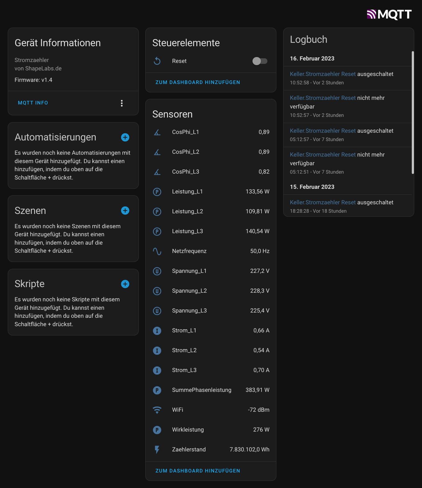

# ESP8266 electricity meter reading head for SGM-C4 meter with homeassistant mqtt-discovery

##Introduction
This project represents a complete electricity meter reading head for the SGM-C4 meter based on ESP8266. No other hardware like a Raspberry-Pi or similar is needed except for the hardware mentioned here. This read head is specially developed for homeassistant, but can also be used for other home automation systems via manual MQTT configuration.
The SML data set is read from the SGM-C4 meter via the optical interface and decoded. The data is transferred to homeassistant via MQTT. At startup, the read head automatically sets itself up as a device via mqtt-discovery with all its entities.

## Hardware
### Electronics
All components are easy to obtain, the optical TX side (U5, Q2, D1, R7, C10) can also remain unpopulated. Currently it is not used. When choosing the IR receiving diode (Q3) the SFH309 should be used. With other diodes there could be problems. Otherwise the circuit is quite trivial and should be easy to build and populate. Board data are available as KiCad files in the repo. For standard-use it's necessary to set Jumper JP2 to 1-2

### Housing
CAD data for a housing is available as a STEP file. There are also STL files that can be printed directly. If no printer is available, the circuit board can also be attached to the electricity meter with double-sided adhesive tape and a few plastic plates (approx. 3 mm thick) as a spacer block.

##Software / Config
For this project it is necessary to enable the complete data output of the electricity meter by means of a PIN code. You can get the PIN code from your metering point operator (in german: "Messstellenbetreiber"), a phone call is sufficient. The metering point operator is obliged to provide the PIN code. For this purpose, you should have the customer data and the meter number available.

### Entering the PIN code
To enter the PIN, you must first press the mechanical key once. After that, the PIN display appears in the lower display line and the first digit appears with a
"0". To enter your PIN, press the key repeatedly until the value of the first digit of your personal PIN appears in the display. After a short waiting time the device is ready (display of a "0") for the input of the 2nd digit of your PIN. Enter the corresponding value of your personal PIN here as well. Then repeat the entry procedure for the 3rd and 4th digits of your PIN in the same way. 

### Configuration of the software
The WLAN access data must be entered in the #define area of the software. In addition, the address or IP of the MQTT broker and its access data are required.
Under "Location" and "Name" the device name as well as its installation location can be assigned. This also results in the MQTT topic. 

```
#define SOFTWARE_VERSION		"v1.4"
#define WLAN_SSID 				"myssid"
#define WLAN_PASS 				"mywifipasswd"
#define MQTT_SERVER 			"192.168.1.2"
#define MQTT_SERVERPORT 		1883 					// use 8883 for SSL
#define MQTT_USERNAME 			"mqttuser"
#define MQTT_KEY 				"mosquitto"
#define LOCATION				"my_location"
#define NAME 					"E_Meter"
//#define OTA_PASS				"admin"
#define STATE_UPDATE_INTERVAL	5000 					// MQTT state update interval in [ms] (<5000ms could be critical for parsing in worst case)
#define AVAILABILITY_ONLINE 	"online"
#define AVAILABILITY_OFFLINE 	"offline"
```

Afterwards the software can be flashed to the ESP8266 with a mini-USB cable and the Arduino IDE. To enter the flash mode, the flash button must be held down while pressing the reset button. After the flash process, the ESP should be reset again.

After that the device should be found automatically in HASSIO with all its entities:

